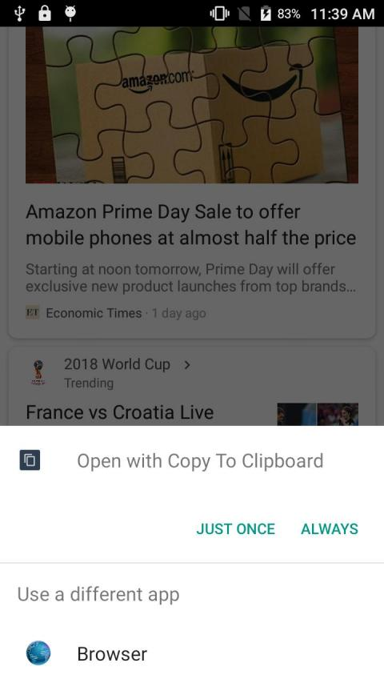
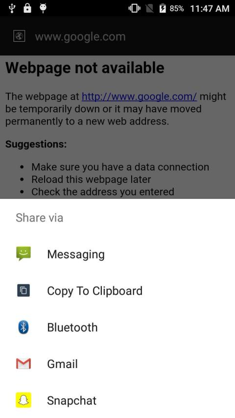

# Copy-To-Clipboard

A very small app allows you to copy links to clipboard before opening in the browser and share text content to clipboard.

**There is no launcher entry so please don't search app after installation :cry:, try to open a link or share some text from an app to see copy to clipboard option**

[Download APK](https://github.com/RSCipher001/Copy-To-Clipboard/raw/master/app-release.apk)

### There are four reasons why I have created this app.

1. We use apps in our phone and many times an app launches an URL but we can't see the URL before it starts loading in our browser, this apps solves the problem now when you choose this app as browser it will copy the link in the clipboard and you can decide whether you are going to visit it or not.

2. Sometimes we want to paste content in an input filed but share options from many apps will not show an option that allows you to copy content to clipboard, this app solves that problem too.

3. This app is minimal, it should be less than 50KB and will run on all devices from API level 14 to 28

4. I wanted an open source app.

### Screenshot

#### On Browser Selection Screen

#### On Share Screen

